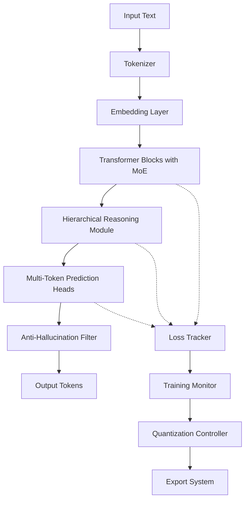

# Design Document

## Overview

This document outlines the technical design for an advanced lightweight nanoLM system that integrates cutting-edge research techniques while maintaining a compact size (100-150MB) suitable for edge deployment. The system implements Mixture of Experts (MoE), Multi-Token Prediction (MTP), Hierarchical Reasoning Model (HRM), and anti-hallucination features with advanced quantization strategies.

The design is based on three key research papers:

1. **Hierarchical Reasoning Model** - Multi-timescale processing with N_cycles and T_steps
2. **4-bit Quantization** - NF4 training and FP4 fine-tuning with NVFP4 format
3. **Multi-Token Prediction** - Simultaneous prediction of multiple future tokens

## Architecture

### High-Level System Architecture



### Core Components

#### 1. Quantized Transformer Architecture

- **Base Model**: 16 layers, 8 attention heads, 384 hidden dimensions
- **Parameter Count**: ~30M parameters (targeting 100-150MB when quantized)
- **Quantization**: NF4 for tr, FP4 for fine-tuning
- **Memory Optimization**: 75% reduction vs FP32

#### 2. Mixture of Experts (MoE) Integration

- **Expert Configuration**: 4 experts per MoE layer
- **Routing Strategy**: Top-1 gating for efficiency
- **Load Balancing**: Auxiliary loss with weight 0.01
- **Placement**: Every 2nd or 4th layer (configurable)

#### 3. Multi-Token Prediction (MTP) System

- **Prediction Horizon**: 4 tokens (t+1, t+2, t+3, t+4)
- **Loss Weighting**: [1.0, 0.5, 0.25, 0.125] (geometric decay)
- **Architecture**: Separate prediction heads for each future position
- **Training Efficiency**: Improved sample efficiency through multi-step prediction

#### 4. Hierarchical Reasoning Module (HRM)

- **Multi-Timescale Processing**: Fast low-level, slow high-level reasoning
- **Cycle Configuration**: N_cycles=2, T_steps=2
- **State Management**: Hierarchical hidden states with different update frequencies
- **Memory Efficiency**: 1-step gradient approximation

## Components and Interfaces

### 1. Model Architecture Components

#### NanoLMModel

```python
class NanoLMModel(nn.Module):
    def __init__(self, config):
        self.embedding = QuantizedEmbedding(config)
        self.transformer_blocks = nn.ModuleList([
            TransformerBlock(config) for _ in range(config.n_layers)
        ])
        self.hrm_module = HierarchicalReasoningModule(config)
        self.mtp_heads = MultiTokenPredictionHeads(config)
        self.anti_hallucination = AntiHallucinationFilter(config)
```

#### TransformerBlock with MoE

```python
class TransformerBlock(nn.Module):
    def __init__(self, config):
        self.attention = MultiHeadAttention(config)
        self.moe_layer = MoELayer(config) if config.use_moe else None
        self.feed_forward = FeedForward(config)
        self.layer_norm1 = LayerNorm(config.d_model)
        self.layer_norm2 = LayerNorm(config.d_model)
```

#### MoELayer

```python
class MoELayer(nn.Module):
    def __init__(self, config):
        self.experts = nn.ModuleList([
            Expert(config) for _ in range(config.n_experts)
        ])
        self.router = Router(config)
        self.load_balancer = LoadBalancer(config)
```

### 2. Quantization System

#### QuantizationController

```python
class QuantizationController:
    def __init__(self, config):
        self.nf4_quantizer = NF4Quantizer(config)
        self.fp4_quantizer = FP4Quantizer(config)
        self.qaf_detector = QAFDetector(config)

    def apply_quantization(self, model, phase="nf4"):
        if phase == "nf4":
            return self.nf4_quantizer.quantize(model)
        elif phase == "fp4":
            return self.fp4_quantizer.quantize(model)
```

#### NF4Quantizer (Training Phase)

```python
class NF4Quantizer:
    def __init__(self, config):
        self.quant_type = "nf4"
        self.compute_dtype = torch.bfloat16
        self.use_double_quant = True
        self.block_size = 64  # Standard for NF4
```

#### FP4Quantizer (Fine-tuning Phase)

```python
class FP4Quantizer:
    def __init__(self, config):
        self.format = "nvfp4"  # E2M1 data, E4M3 scale
        self.block_size = 16   # Optimal from research
        self.split_rounding = True
        self.stochastic_rounding = True
```

### 3. Training and Loss System

#### MultiComponentLoss

```python
class MultiComponentLoss:
    def __init__(self, config):
        self.main_loss_weight = 1.0
        self.mtp_loss_weight = 0.5
        self.aux_loss_weight = 0.01
        self.reasoning_loss_weight = 0.1
        self.anti_hallucination_weight = 0.25

    def calculate_total_loss(self, outputs, targets):
        main_loss = self.calculate_main_loss(outputs.logits, targets)
        mtp_loss = self.calculate_mtp_loss(outputs.mtp_logits, targets)
        aux_loss = self.calculate_aux_loss(outputs.router_logits)
        reasoning_loss = self.calculate_reasoning_loss(outputs.reasoning_logits, targets)
        anti_hallucination_loss = self.calculate_anti_hallucination_loss(outputs.logits)

        return (main_loss * self.main_loss_weight +
                mtp_loss * self.mtp_loss_weight +
                aux_loss * self.aux_loss_weight +
                reasoning_loss * self.reasoning_loss_weight +
                anti_hallucination_loss * self.anti_hallucination_weight)
```

#### LossTracker

```python
class LossTracker:
    def __init__(self, config):
        self.prediction_methods = [
            ExponentialDecayPredictor(),
            PowerLawPredictor(),
            TrendPredictor(),
            LearningCurvePredictor()
        ]
        self.convergence_detector = ConvergenceDetector()

    def predict_final_loss(self, loss_history):
        predictions = [method.predict(loss_history) for method in self.prediction_methods]
        return self.ensemble_prediction(predictions)
```

### 4. Export and Deployment System

#### MultiPlatformExporter

```python
class MultiPlatformExporter:
    def __init__(self, config):
        self.exporters = {
            'torchscript': TorchScriptExporter(),
            'onnx': ONNXExporter(),
            'coreml': CoreMLExporter(),
            'huggingface': HuggingFaceExporter(),
            'tflite': TensorFlowLiteExporter(),
            'webassembly': WebAssemblyExporter()
        }

    def export_all_formats(self, model, output_dir):
        results = {}
        for format_name, exporter in self.exporters.items():
            try:
                results[format_name] = exporter.export(model, output_dir)
            except Exception as e:
                results[format_name] = {'error': str(e)}
        return results
```

## Data Models

### Configuration Schema

```python
@dataclass
class NanoLMConfig:
    # Model Architecture
    vocab_size: int = 29086
    n_layers: int = 16
    n_heads: int = 8
    d_model: int = 384
    d_ff: int = 1536
    seq_len: int = 256

    # MoE Configuration
    use_moe: bool = True
    moe_every: int = 2
    n_experts: int = 4
    moe_top_k: int = 1

    # MTP Configuration
    mtp_k: int = 4
    mtp_loss_weights: List[float] = field(default_factory=lambda: [1.0, 0.5, 0.25, 0.125])

    # HRM Configuration
    use_hrm: bool = True
    hrm_segments: int = 2
    hrm_N_cycles: int = 2
    hrm_T_steps: int = 2

    # Quantization Configuration
    use_quantization: bool = True
    use_bnb_4bit: bool = True
    bnb_4bit_quant_type: str = "nf4"
    fp4_format: str = "nvfp4"
    fp4_block_size: int = 16

    # Training Configuration
    lr: float = 2e-5
    weight_decay: float = 0.01
    max_grad_norm: float = 1.0
    num_epochs: int = 10
    micro_batch_size: int = 8
    grad_accum_steps: int = 4
```

### Model Output Schema

```python
@dataclass
class ModelOutput:
    logits: torch.Tensor              # Main prediction logits [batch, seq, vocab]
    mtp_logits: List[torch.Tensor]    # Multi-token prediction logits
    router_logits: torch.Tensor       # MoE router outputs
    reasoning_logits: torch.Tensor    # Reasoning head outputs
    hidden_states: torch.Tensor       # Final hidden states
    attention_weights: torch.Tensor   # Attention weights for analysis
    expert_usage: torch.Tensor        # Expert utilization statistics
```

### Training Metrics Schema

```python
@dataclass
class TrainingMetrics:
    step: int
    epoch: int
    main_loss: float
    mtp_loss: float
    aux_loss: float
    reasoning_loss: float
    anti_hallucination_loss: float
    total_loss: float
    learning_rate: float
    grad_norm: float
    memory_usage: float
    tokens_per_second: float
    expert_balance: Dict[int, float]
    convergence_score: float
```

## Error Handling

### Gradient Management

```python
class GradientManager:
    def __init__(self, config):
        self.max_grad_norm = config.max_grad_norm
        self.gradient_monitor = GradientMonitor()

    def handle_gradient_issues(self, model, loss):
        grad_stats = self.gradient_monitor.analyze_gradients(model)

        if grad_stats.has_explosion:
            self.apply_gradient_clipping(model)
        elif grad_stats.has_vanishing:
            self.adjust_learning_rate(increase=True)
        elif grad_stats.has_stagnation:
            self.trigger_qaf_transition()
```

### Memory Management

```python
class MemoryManager:
    def __init__(self, config):
        self.memory_threshold = 0.9  # 90% GPU memory usage
        self.cleanup_strategies = [
            CacheClearing(),
            GarbageCollection(),
            BatchSizeReduction(),
            GradientCheckpointingToggle()
        ]

    def handle_oom_error(self, error):
        for strategy in self.cleanup_strategies:
            if strategy.can_handle(error):
                strategy.apply()
                return True
        return False
```

### Training Recovery

```python
class TrainingRecovery:
    def __init__(self, config):
        self.checkpoint_manager = CheckpointManager(config)
        self.error_handlers = {
            'oom': self.handle_oom,
            'gradient_explosion': self.handle_gradient_explosion,
            'loss_divergence': self.handle_loss_divergence,
            'quantization_error': self.handle_quantization_error
        }

    def recover_from_error(self, error_type, context):
        if error_type in self.error_handlers:
            return self.error_handlers[error_type](context)
        else:
            return self.fallback_recovery(context)
```

## Testing Strategy

### Unit Testing

- **Component Tests**: Individual module testing (MoE, MTP, HRM, Quantization)
- **Loss Function Tests**: Verify multi-component loss calculation
- **Quantization Tests**: Validate NF4/FP4 quantization accuracy
- **Export Tests**: Ensure all export formats work correctly

### Integration Testing

- **Feature Combination Tests**: MoE + MTP + HRM + Anti-hallucination
- **Training Pipeline Tests**: End-to-end training with all features
- **Memory Management Tests**: OOM handling and recovery
- **Platform Compatibility Tests**: Edge device deployment validation

### Performance Testing

- **Convergence Tests**: Verify loss reduction and final targets
- **Memory Usage Tests**: Confirm 75% memory reduction
- **Speed Tests**: Validate tokens/second performance
- **Model Size Tests**: Ensure 100-150MB target is met

### Quality Assurance

- **Baseline Comparisons**: Compare against known model performance
- **Perplexity Validation**: Ensure competitive perplexity scores
- **Generation Quality**: Validate coherent text generation
- **Edge Device Testing**: Real-world deployment validation

## Implementation Phases

### Phase 1: Core Architecture (NF4 Training)

1. Implement quantized transformer with NF4
2. Integrate MoE layers with load balancing
3. Add multi-component loss system
4. Implement basic training pipeline

### Phase 2: Advanced Features

1. Add Multi-Token Prediction heads
2. Implement Hierarchical Reasoning Module
3. Integrate anti-hallucination filtering
4. Add comprehensive loss tracking

### Phase 3: Optimization and Fine-tuning

1. Implement FP4 fine-tuning phase
2. Add automatic QAF transition detection
3. Optimize memory management
4. Implement gradient monitoring

### Phase 4: Export and Deployment

1. Create multi-platform export system
2. Add edge device optimizations
3. Implement deployment validation
4. Create comprehensive documentation

This design provides a robust foundation for implementing the advanced nanoLM system while ensuring all requirements are met and the system remains maintainable and extensible.
